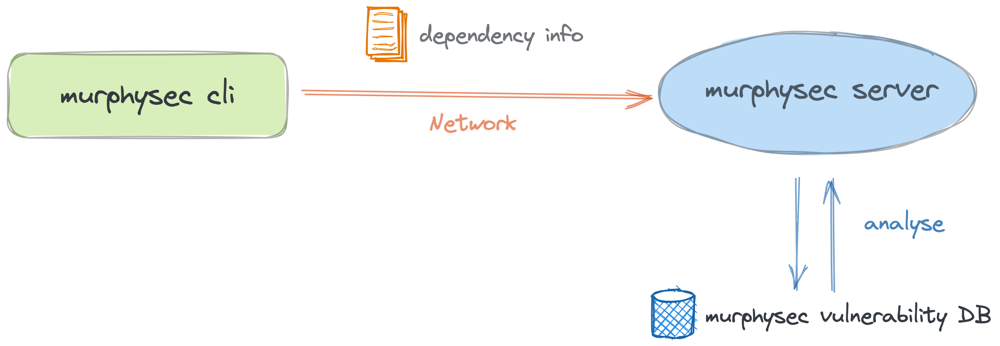

# README.md

墨菲安全的 **CLI 工具**，用于在命令行检测指定目录代码的依赖安全问题，也可以基于 CLI 工具实现在 CI 流程的检测。


<p>

  <a href="https://github.com/murphysecurity/murphysec">
    
  </a>


  <a href="https://github.com/murphysecurity/murphysec/blob/master/LICENSE">
    
  </a>
  
  
  </p>


## 使用场景
1. 希望在本地环境中检测代码文件
2. 希望集成到 CI 环境中对代码项目进行检测

参考：[墨菲安全 CLI 与 Jenkins CI 的集成](https://www.murphysec.com/docs/integrations/jenkins/)

## 工作原理


1. 对于使用不同语言/包管理工具的项目，墨菲安全的 CLI 工具主要采用`项目构建`或直接对`包管理文件`进行解析的方式，来准确获取到项目的依赖信息
2. 项目的依赖信息会上传到服务端，并基于墨菲安全持续维护的`漏洞知识库`来识别项目中存在安全缺陷的依赖



> 说明：CLI 工具只会将检测项目的依赖和基本信息发送到墨菲安全服务端，用于识别存在安全缺陷的依赖，不会上传任何本地代码。


## 使用步骤
### 1. 安装

访问 [GitHub Releases](https://github.com/murphysecurity/murphysec/releases/latest) 页面下载最新版本的墨菲安全 CLI，或执行以下相关命令：

#### 在 Linux 上安装

```
curl -sL "https://github.com/murphysecurity/murphysec/releases/latest/download/murphysec-linux-amd64" -o murphysec
chmod +x murphysec
```
#### 在 OSX 上安装

```
curl -sL "https://github.com/murphysecurity/murphysec/releases/latest/download/murphysec-darwin-amd64" -o murphysec
chmod +x murphysec
```

#### 在 WINDOWS 上安装

```
scoop bucket add murphysec https://github.com/murphysecurity/scoop-bucket
scoop update
scoop install murphysec
```

### 2. 获取访问令牌

目前墨菲安全平台注册需要邀请码，限时发放中，[点击获取](https://www.murphysec.com/docs/faq/get-invite-code/)

> CLI 工具需要使用墨菲安全账户的`访问令牌`进行认证才能正常使用。[访问令牌是什么？（点击查看详情）](https://www.murphysec.com/docs/faq/access-token/)


进入[墨菲安全控制台](https://www.murphysec.com/control/set)，点击`个人设置`，复制页面中的`访问令牌`


### 3. 认证

目前有两种认证方式可用：命令行交互认证、命令行参数认证

#### 命令行交互认证
执行`murphysec auth login`命令，粘贴访问令牌即可。


> 认证后下次使用墨菲安全 CLI 无需再次执行此操作，如果需要更换访问令牌，可以重复执行此命令来覆盖旧的访问令牌。


#### 命令行参数认证
执行检测命令时，通过增加`--token`参数指定访问令牌进行认证

### 4. 检测

使用`murphysec scan`命令进行检测，可以执行以下命令：

``` bash
murphysec scan [your-project-path]
```

可用的参数
- `--token`：指定访问令牌
- `--log-level`：指定命令行输出流打印的日志级别，默认不打印日志，可选参数为`silent`、`error`、`warn`、`info`、`debug`
- `--json`：指定检测的结果输出为json，默认不展示结果详情


### 5. 查看结果

CLI 工具默认不展示结果详情，可以在[墨菲安全控制台](https://www.murphysec.com/control/project)-`项目`页面查看详细的检测结果


## 命令介绍

### murphysec auth
`murphysec auth` 命令主要是管理 CLI 的认证

```
Usage:
  murphysec auth [command]

Available Commands:
  login
  logout
```

### murphysec scan
`murphysec scan` 命令主要用于执行检测

```
Usage:
  murphysec scan DIR [flags]

Flags:
  -h, --help   help for scan
      --json   json output

Global Flags:
      --log-level string      specify log level, must be silent|error|warn|info|debug
      --no-log-file           do not write log file
      --server string         specify server address
      --token string          specify API token
  -v, --version               show version and exit
      --write-log-to string   specify log file path

```


## 交流和问题反馈

联系并添加运营微信号，拉您进墨菲安全交流微信群


## 开源协议

[Apache 2.0](LICENSE)
